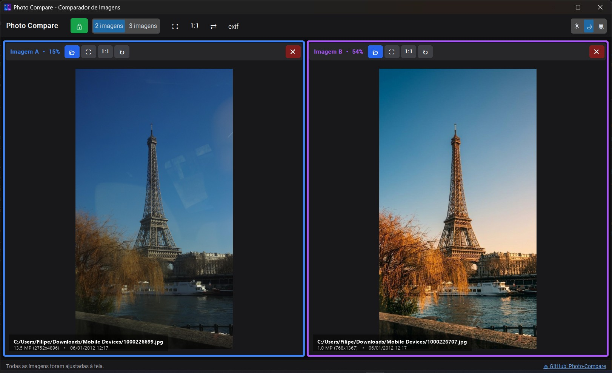
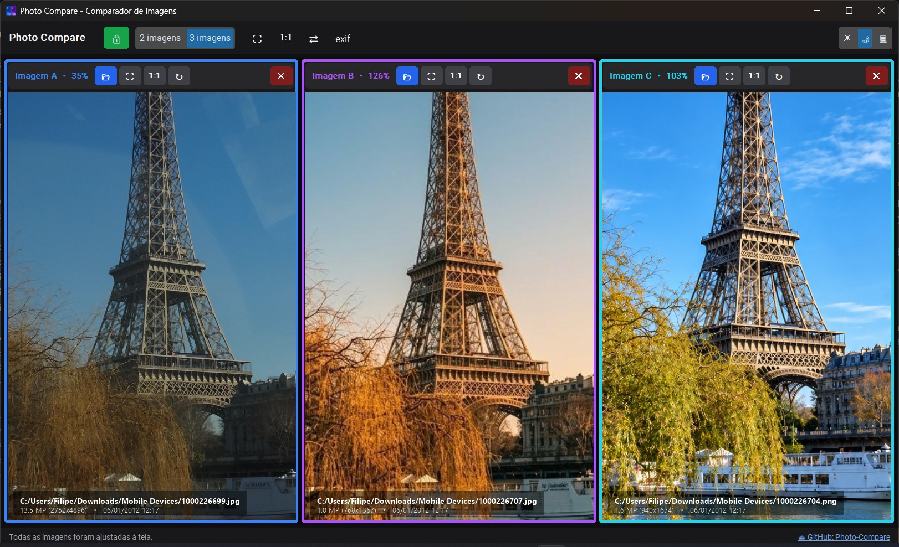
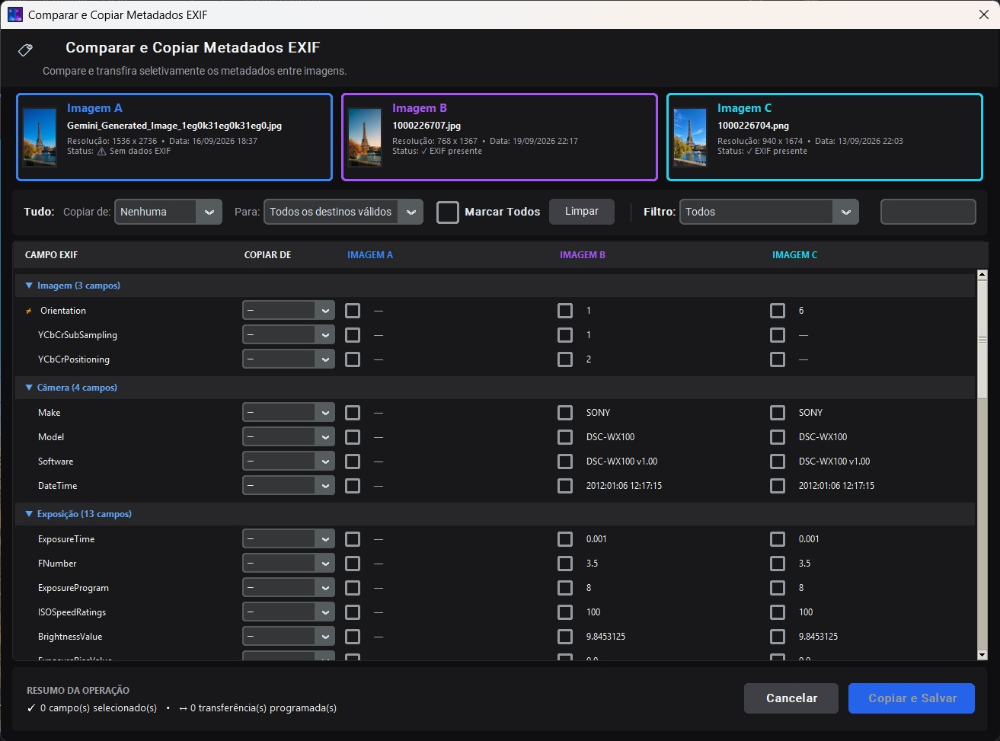

# Photo Compare - Comparador de Imagens

## Capturas de Tela


*Interface padrão com 2 colunas para comparação direta*


*Interface expandida com 3 colunas ativadas*


*Janela de comparação e cópia de metadados EXIF entre as imagens*

Aplicação desktop profissional desenvolvida em **Python** e **Tkinter/CustomTkinter** para comparação visual lado a lado de imagens de alta resolução, com suporte a **2 ou 3 colunas**, **pan** (arrastar) e **zoom** sincronizados ou independentes, além de uma avançada ferramenta de **comparação e transferência seletiva de metadados EXIF**.

🔗 **Repositório GitHub**: [https://github.com/filipesizilio/photo-compare](https://github.com/filipesizilio/photo-compare)

---

## 🚀 Funcionalidades

- **2 ou 3 Colunas Dinâmicas**: Inicia com 2 colunas para comparação direta. É possível adicionar ou ocultar uma 3ª coluna a qualquer momento através do controle na barra superior.
- **📂 Seleção Múltipla Inteligente (Até 3 Imagens)**:
  - **1 imagem selecionada**: Carrega na janela livre disponível, da esquerda para a direita (ou na coluna clicada).
  - **2 imagens selecionadas**: Carrega a primeira na **Imagem A** (esquerda) e a segunda na **Imagem B** (direita).
  - **3 imagens selecionadas**: Abre automaticamente a 3ª coluna e distribui as imagens em sequência nas colunas A, B e C.
- **🖱️ Arraste e Solte Nativo (Drag & Drop)**:
  - Arraste arquivos de imagem diretamente do Windows Explorer ou Desktop para a janela do aplicativo.
  - Solte 1 imagem sobre uma coluna específica para carregá-la diretamente nela.
  - Solte 2 ou 3 imagens em qualquer lugar da janela para distribuí-las automaticamente.
- **Navegação com Pan & Zoom**:
  - **Pan**: Clique e arraste com o botão esquerdo do mouse para navegar pela imagem.
  - **Zoom**: Roda do mouse (*mouse scroll wheel*) com ampliação ou redução centrada exatamente onde o cursor do mouse está apontando.
- **Controles Travados / Sincronizados**:
  - **🔒 Sincronização Travada**: Mover ou aplicar zoom em uma das imagens reflete instantaneamente em todas as outras colunas.
  - **🔓 Sincronização Destravada**: Permite alinhar ou reposicionar uma imagem individualmente antes de travar novamente.
- **Ajustes Rápidos**:
  - Botão **⛶ Ajustar [Todas]** (ajusta as imagens para caberem 100% na janela - tecla `F`).
  - Botão **1:1 [Todas]** (define a escala em 100% no centro da imagem).
  - Botão **⇄ Alinhar [à Imagem A]** (alinha o enquadramento e escala das outras colunas com base no primeiro painel).
  - Duplo clique no canvas para ajustar a imagem à tela.
- **Alta Performance (Viewport Crop)**:
  - Utiliza recorte da região visível (*viewport cropping*) com a biblioteca Pillow, garantindo navegação a 60 FPS mesmo para fotos pesadas de 24MP, 50MP ou superiores.
- **Formatos Suportados**: JPG, JPEG, PNG, WEBP, BMP, TIFF, GIF, etc.

---

## 🏷️ Comparação e Cópia de Metadados EXIF (Totalmente Redesenhada na v1.2.0)

A janela de metadados foi completamente reformulada para oferecer uma experiência analítica de ponta, substituindo listas isoladas por uma **tabela comparativa unificada**, intuitiva e com layout pixel-a-pixel 1:1:

- **Ordem Racional de Colunas**:
  ```text
  ┌──────────────┬────────────┬──────────────┬──────────────┬──────────────┐
  │ CAMPO EXIF   │ COPIAR DE  │ IMAGEM A     │ IMAGEM B     │ IMAGEM C     │
  ├──────────────┼────────────┼──────────────┼──────────────┼──────────────┤
  │ Make         │ [ A ▼ ]    │ ☑ Sony       │ ☑ Sony      │ ☑ Canon      │
  │ Model        │ [ A ▼ ]    │ ☑ ILCE-7M4   │ ☑ ILCE-7M4  │ ☑ EOS R5     │
  │ FNumber      │ [ B ▼ ]    │ ☑ 2.8        │ ☑ 2.8       │ ☑ 4.0        │
  │ ISO          │ [ — ▼ ]    │ ☐ 100        │ ☐ 200       │ ☐ 400        │
  └──────────────┴────────────┴──────────────┴──────────────┴──────────────┘
  ```
- **Cards Superiores das Imagens**:
  - Miniaturas proporcionais de alta fidelidade geradas via Pillow sem distorção.
  - Resolução, data do arquivo, presença de EXIF e bordas temáticas identificando as imagens (**A** Azul, **B** Violeta, **C** Ciano).
- **Checkboxes de Destino Diretos**:
  - Posicionados exclusivamente à frente dos valores das colunas Imagem A, B e C que receberão os metadados.
  - **Bloqueio Automático de Origem**: A imagem definida na coluna "Copiar de" tem seu checkbox de destino imediatamente bloqueado, impedindo transferências redundantes de uma imagem para ela mesma.
- **Detecção Visual de Diferenças (`≠`)**:
  - Indicador amarelo `≠` ao lado de qualquer campo cujos valores divirjam entre as imagens abertas.
- **Categorias Recolhíveis (Accordions)**:
  - Agrupamento expansível por seções lógicas: *Imagem, Câmera, Exposição, Data/Hora, GPS e Outros*, com contadores de campos totais e selecionados.
- **Ações em Lote e Filtros Avançados**:
  - Comboboxes globais **Copiar de** e **Para** para programar todas as tags visíveis de uma só vez.
  - Checkbox **Marcar Todos** e botão **Limpar**.
  - Filtros instantâneos: *Todos*, *Somente diferentes*, *Somente presentes em todas*, *Somente ausentes em alguma*, *Somente selecionados*.
  - **Campo de Busca Textual**: Filtragem em tempo real por nome de tag.
- **Resumo da Operação em Tempo Real**:
  - Exibe a quantidade exata de campos selecionados, transferências programadas e alerta em destaque caso haja sobrescrita de valores existentes.
- **Gravação Segura e Confiável**:
  - Diálogo prévio de confirmação detalhado.
  - Backup automático de segurança durante a escrita e preservação integral das demais tags originais de cada arquivo.
- **Persistência de Janela**:
  - Posição e dimensões da janela EXIF são gravadas em `%APPDATA%\PhotoCompare\config.json`, reabrindo sempre na mesma configuração desejada pelo usuário.

---

## 🌓 Alternância de Tema e Controle Segmentado

O controle de tema na barra superior utiliza um botão segmentado (`CTkSegmentedButton`) moderno com 3 modos:

- ☀ **Sol**: Força o Modo Claro (`light`).
- 🌙 **Lua**: Força o Modo Escuro (`dark`).
- 💻 **Computador**: Sincroniza dinamicamente com o modo do Windows (`system`).

### 📌 Prevalência de Configuração
- O valor `"appearance_mode"` do arquivo de tema (`default.json`) serve apenas como **padrão na primeira inicialização**.
- Sempre que o usuário escolhe um modo pelo controle na barra de ferramentas, a opção é salva em `%APPDATA%\PhotoCompare\config.json` e **sempre prevalece** sobre o tema nas aberturas seguintes.

---

## 🎨 Sistema de Temas Personalizáveis (JSON)

O PhotoCompare suporta personalização integral da interface através de arquivos `.json`:

- **Pasta de Temas do Usuário**: `%APPDATA%\PhotoCompare\themes\` (ex: `%APPDATA%\PhotoCompare\themes\default.json`).
- **Guia Completo**: O arquivo explicativo [`themes/LEIAME.txt`](./themes/LEIAME.txt) detalha todas as chaves e paletas:
  - `appearance_mode`: modo inicial (`"system"`, `"dark"` ou `"light"`).
  - `color_theme`: tema base do CustomTkinter (`"blue"`, `"dark-blue"`, `"green"`).
  - `corner_radius`: raio de arredondamento dos cantos em pixels (padrão: `6`).
  - `overlay_alpha`: nível de opacidade da Legenda Overlay (padrão: `0.45`).
  - Bloco `colors`: pares `[Modo Claro, Modo Escuro]` ou cores únicas para janelas, barras, botões, bordas, canvas e legendas.
- **Ativação Simples**: Em `%APPDATA%\PhotoCompare\config.json`, basta definir a chave `"theme"` com o nome do arquivo JSON:
  ```json
  {
    "theme": "meu_tema",
    "appearance_mode": "dark"
  }
  ```

---

##  Executável Portátil (.EXE)

Você pode executar o PhotoCompare diretamente sem ter o Python instalado!

- Executável gerado na pasta: **`dist/PhotoCompare_v1.2.0.exe`**
- Totalmente autocontido com todas as bibliotecas, temas e ícones embutidos.

---

## 📐 Qualidade de Código e Arquitetura Modular (Gate 350 Linhas)

O PhotoCompare adota um **Quality Gate rigoroso via Pylint** (`max-module-lines = 350` / regra `C0302`):
- **100% dos arquivos do projeto possuem ≤ 350 linhas de código**, garantindo separação estrita de responsabilidades, alta manutenibilidade e nota **10.00/10** em auditoria de código.
- **Módulos desacoplados**:
  - `image_viewer_interaction.py`: Interações de viewport, zoom e pan.
  - `ui_tooltip.py`: Tooltips universais flutuantes com delay e auto-descarte.
  - `app_paths.py`: Resolução agnóstica de diretórios (código-fonte e .EXE empacotado).
  - `theme_config.py`: Parser de temas JSON e paletas de cores.
  - `exif_models.py`, `exif_cards_view.py`, `exif_actions_bar.py`, `exif_table_view.py`, `exif_popup.py`: Arquitetura em camadas da interface e lógica EXIF.
- **Suíte de Testes Automatizados**:
  - `test_app.py`: 14 testes cobrindo sincronização, carregamento múltiplo, drag & drop e layout dinâmico.
  - `test_exif_refactor.py`: 5 testes cobrindo leitura, comparação, bloqueio de origem, cálculo de resumo e transferência física de metadados em disco.

---

## 🛠️ Como Executar a Partir do Código-Fonte

### 1. Pré-requisitos
Python 3.9 ou superior instalado.

### 2. Instalação das Dependências
```bash
pip install -r requirements.txt
```

### 3. Execução
```bash
python photocompare.py
```

### 4. Executar Suíte de Testes
```bash
python test_app.py
python test_exif_refactor.py
```

### 5. Compilar Executável (.EXE)
```bash
python build.py
```
*(Gera o arquivo `PhotoCompare_v1.2.0.exe` em `dist/` a partir do `PhotoCompare.spec`).*

---

## ⌨️ Atalhos de Teclado

| Tecla | Ação |
| :--- | :--- |
| `Espaço` | Alternar trava de sincronização (Travada 🔒 / Destravada 🔓) |
| `F` | Ajustar todas as imagens abertas à tela (Fit to Window) |
| `Ctrl + O` | Abrir seletor de arquivos na primeira coluna vazia |
| `Duplo Clique` | Ajustar a imagem da coluna clicada à janela |
| `Scroll do Mouse` | Zoom In / Zoom Out centrado no cursor |
| `Arrastar (Botão Esquerdo)` | Pan (mover enquadramento da imagem) |
| `Esc` | Fechar a janela de metadados EXIF |

---

## 📝 Notas de Atualização (Changelog)

### Versão 1.2.0
- **Janela de Metadados EXIF Redesenhada**:
  - Nova tabela comparativa unificada consolidando todas as imagens em uma única visualização tabular.
  - Grid proporcional com alinhamento rigoroso entre títulos e dados.
  - Checkboxes de destino diretos nos valores de cada imagem (eliminada coluna redundante à esquerda).
  - Cards horizontais de imagens com miniaturas proporcionais Pillow e metadados rápidos.
  - Bloqueio automático de origem como destino impedindo operações redundantes.
  - Indicador visual `≠` em amarelo destacando tags com valores divergentes.
  - Categorias recolhíveis (accordions) com contadores em tempo real.
  - Filtros dinâmicos e busca instantânea de tags por digitação.
  - Resumo de operação em tempo real com alertas de sobrescrita.
  - Gravação segura e preservação de metadados nativos.
  - Persistência das dimensões e posicionamento da janela EXIF em `config.json`.
- **Controle de Modo de Aparência Segmentado**:
  - Substituição do botão simples por um `CTkSegmentedButton` de 3 opções: Claro (☀), Escuro (🌙) e Sistema (💻).
  - Prevalência do modo gravado em `config.json` sobre o tema padrão.
- **Correções e Refinamentos de Interface**:
  - Correção do link clicável do GitHub na barra de status com detecção completa de área de clique.
- **Refatoração Arquitetural e Quality Gate (Pylint 350 linhas)**:
  - Limite estrito de 350 linhas por arquivo implementado em `pyproject.toml`.
  - Refatoração completa de arquivos monolíticos em módulos especializados com responsabilidade única.
  - Nota 10.00/10 no Pylint e aprovação total nas suítes `test_app.py` e `test_exif_refactor.py`.

### Versão 1.1.0
- Nova nomenclatura oficial das colunas: Imagem A, B e C.
- Bordas temáticas arredondadas destacando cada imagem.
- Legenda overlay com fontes ampliadas (14pt e 13pt) e suporte a temas.
- Sistema de temas personalizáveis via JSON.
