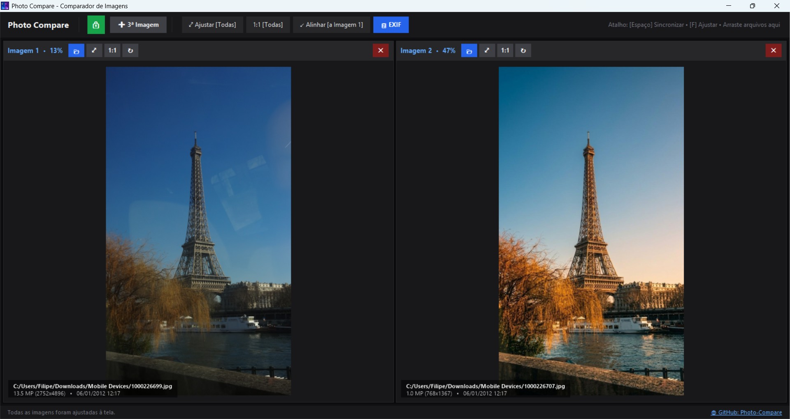
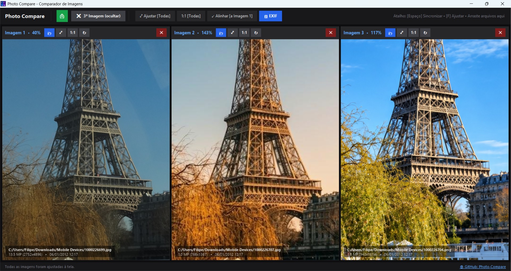
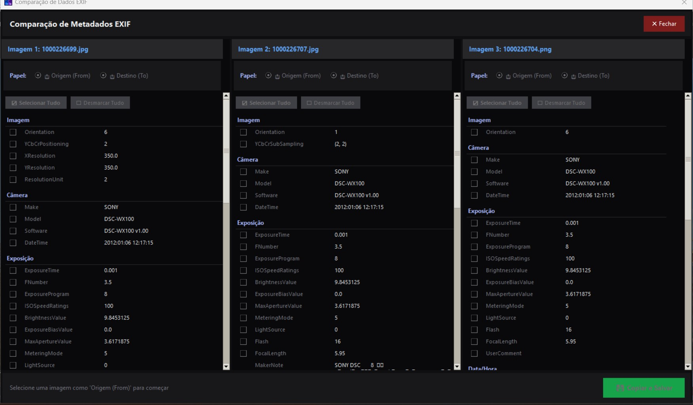

# Photo Compare - Comparador de Imagens

## Capturas de Tela


*Interface padrão com 2 colunas para comparação direta*


*Interface expandida com 3 colunas ativadas*


*Janela de comparação de metadados EXIF entre as imagens*

Aplicação desktop desenvolvida em **Python** e **Tkinter** para comparação visual lado a lado de imagens de alta resolução, com suporte a **2 ou 3 colunas**, **pan** (arrastar) e **zoom** sincronizados ou independentes.

🔗 **Repositório GitHub**: [https://github.com/filipesizilio/photo-compare](https://github.com/filipesizilio/photo-compare)

---

## 🚀 Funcionalidades

- **2 ou 3 Colunas Dinâmicas**: Inicia com 2 colunas para comparação direta. É possível adicionar ou ocultar uma 3ª coluna a qualquer momento através da barra superior.
- **📂 Seleção Múltipla Inteligente (Até 3 Imagens)**:
  - **1 imagem selecionada**: Carrega na janela livre disponível, da esquerda para a direita (ou na coluna clicada).
  - **2 imagens selecionadas**: Carrega a primeira na **Imagem A** (esquerda) e a segunda na **Imagem B** (direita).
  - **3 imagens selecionadas**: Abre automaticamente a 3ª coluna e distribui as imagens em sequência nas colunas A, B e C.
- **🖱️ Arraste e Solte Nativo (Drag & Drop)**:
  - Arraste arquivos de imagem diretamente do Windows Explorer ou Desktop para a janela do aplicativo.
  - Solte 1 imagem sobre uma coluna específica para carregá-la diretamente nela.
  - Solte 2 ou 3 imagens em qualquer lugar da janela para distribuí-las automaticamente.
- **Navegação com Pan & Zoom**:
  - **Pan**: Clique e arraste com o botão esquerdo do mouse para navegar pela imagem.
  - **Zoom**: Roda do mouse (*mouse scroll wheel*) com ampliação ou redução centrada exatamente onde o cursor do mouse está apontando.
- **Controles Travados / Sincronizados**:
  - **🔒 Sincronização Travada**: Mover ou aplicar zoom em uma das imagens reflete instantaneamente em todas as outras colunas.
  - **🔓 Sincronização Destravada**: Permite alinhar ou reposicionar uma imagem individualmente antes de travar novamente.
- **Ajustes Rápidos**:
  - Botão **⤢ Ajustar [Todas]** (ajusta as imagens para caberem 100% na janela).
  - Botão **1:1 [Todas]** (define a escala em 100% no centro da imagem).
  - Botão **↙ Alinhar [à Imagem A]** (alinha o enquadramento e escala das outras colunas com base no primeiro painel).
  - Duplo clique no canvas para ajustar a imagem à tela.
- **📋 Comparação de EXIF**: Botão **EXIF** na barra superior abre uma janela comparando lado a lado os metadados EXIF (câmera, lente, ISO, abertura, velocidade, data, GPS, etc.) das imagens carregadas.
- **Alta Performance (Viewport Crop)**:
  - Utiliza recorte da região visível (*viewport cropping*) com a biblioteca Pillow, garantindo navegação a 60 FPS mesmo para fotos pesadas de 24MP, 50MP ou superiores.
- **Formatos Suportados**: JPG, JPEG, PNG, WEBP, BMP, TIFF, GIF, etc.

---

## 📦 Executável Portátil (.EXE)

Você pode executar o aplicativo diretamente sem precisar ter o Python instalado! O executável já contém todas as bibliotecas e o ícone personalizado embutidos:

- O arquivo gerado está em: **`dist/PhotoCompare_v1.1.0.exe`**
- Basta dar um duplo clique no executável para usar!

---

## 🎨 Sistema de Temas Personalizáveis (JSON)

A partir da versão **1.1.0**, o PhotoCompare conta com um sistema de temas personalizável via arquivos `.json`:

- **Localização dos Temas**: Salvos na pasta do usuário em `%APPDATA%\PhotoCompare\themes\` (ex: `%APPDATA%\PhotoCompare\themes\default.json`).
- **Guia Completo**: Um arquivo explicativo [`LEIAME.txt`](./themes/LEIAME.txt) é gerado automaticamente na pasta de temas descrevendo todas as propriedades suportadas:
  - `appearance_mode`: modo `"system"` (sincronizado com o Windows), `"dark"` ou `"light"`.
  - `color_theme`: paleta base do CustomTkinter (`"blue"`, `"dark-blue"`, `"green"`).
  - `corner_radius`: raio de arredondamento dos cantos em pixels (ex: `6`).
  - `overlay_alpha`: nível de opacidade da Legenda Overlay (ex: `0.55`).
  - Cores individuais e adaptáveis em pares `[Modo Claro, Modo Escuro]` ou valor único para janelas, barras, botões, bordas e legendas.
- **Ativação Simples**: No arquivo `%APPDATA%\PhotoCompare\config.json`, basta definir a chave:
  ```json
  {
    "theme": "nome_do_tema"
  }
  ```

---

## 📝 Notas de Atualização (Changelog)

### Versão 1.1.0
- **Interface Melhorada e Padronizada**:
  - Nova nomenclatura oficial das colunas: **Imagem A**, **Imagem B** e **Imagem C** em toda a interface, botões, tooltips, alertas e diálogos de metadados.
  - Bordas coloridas com cantos arredondados (`corner_radius: 6`) e espessura de **4px** destacando cada imagem na tela principal e na janela de metadados EXIF:
    - **Imagem A**: Azul
    - **Imagem B**: Violeta
    - **Imagem C**: Ciano / Turquesa
  - Margens internas ajustadas para que o canvas retangular não corte os cantos arredondados dos painéis.
  - **Legenda Overlay Aprimorada**:
    - Tamanho das fontes aumentado para **14pt** (título/caminho) e **13pt** (resolução, megapixels e data), facilitando significativamente a leitura sobre fotos.
    - Suporte total a temas no HUD: cor de fundo (`overlay_bg`), cores de texto (`overlay_text`, `overlay_subtext`) e controle fino de transparência (`overlay_alpha`).
- **Sistema de Temas JSON**:
  - Suporte a temas externos salvos em `%APPDATA%\PhotoCompare\themes\`.
  - Criação automática do tema base `default.json` e do guia completo `LEIAME.txt`.
  - Sincronização e persistência de preferências em `config.json`.
- **Compatibilidade e Estabilidade**:
  - Suporte refinado aos modos Claro e Escuro dinâmicos.
  - Todos os testes automatizados da suíte atualizados e validados.

---

## 🛠️ Como Executar a Partir do Código-Fonte

### 1. Pré-requisitos
Certifique-se de ter o Python 3.9+ instalado.

### 2. Instalação das Dependências
Instale os pacotes necessários listados no `requirements.txt`:
```bash
pip install -r requirements.txt
```

### 3. Execução
Execute o arquivo principal:
```bash
python photocompare.py
```

### 4. Gerar Novo Executável
Caso faça alterações no código e deseje recompilar o `.exe`, execute o script de build (que lê as configurações de nome e versão do arquivo `PhotoCompare.spec`):
```bash
python build.py
```

O executável gerado seguirá o padrão `PhotoCompare_v<versão>.exe` na pasta `dist/` (a versão atual é definida em `PhotoCompare.spec`).

---

## ⌨️ Atalhos de Teclado

| Tecla | Ação |
| :--- | :--- |
| `Espaço` | Alternar trava de sincronização (Travada / Destravada) |
| `F` | Ajustar todas as imagens abertas à tela |
| `Ctrl + O` | Abrir imagem na primeira coluna vazia |
| `Duplo Clique` | Ajustar a imagem da coluna clicada à tela |
| `Scroll do Mouse` | Zoom In / Zoom Out centrado no cursor |
| `Arrastar (Botão Esquerdo)` | Pan (mover imagem) |

